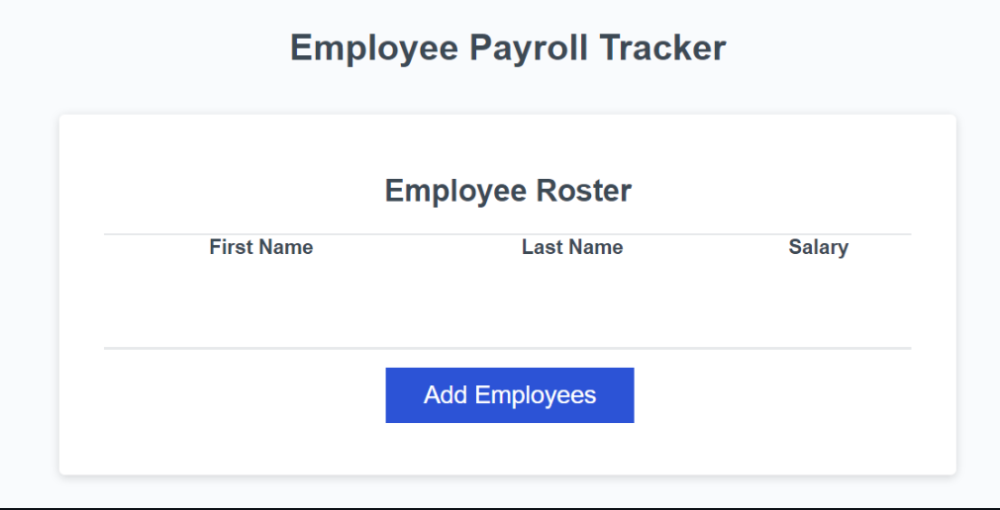

# Employee Payroll Tracker

This Employee Payroll Tracker is my first challenge using JavaScript. It is a web application that asks users to input as many employees first & last name aa well as a salary for them. It calculates and displays the average salary of all employees and prints back a table displaying the users input.

## Features

- Users add first & last name and salary.
- In the console, application shows the average salary of all the employees.

## Technologies 

We used:
- JavaScript
- HTML

## Usage

- Click on "Add Employees" button.
- Input data requested (firstName, lastName, employeeSalary).
- Choose whether or not to add another employee (repeating action).
- Web App will display table listing all the employees and their salaries.

## License

MIT License
